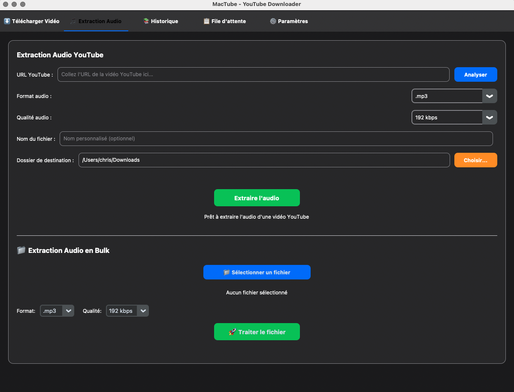

# MacTube - YouTube Downloader pour MacOS

<div align="center">


**Une application native MacOS élégante et moderne pour télécharger des vidéos YouTube en haute qualité**

</div>

---

## ✨ Fonctionnalités

- **Interface native MacOS** avec thèmes clair/sombre automatiques
- **Navigation par onglets** organisée (Télécharger, Audio, Historique, File d'attente, Paramètres)
- **Téléchargement HD** jusqu'à 4K avec `yt-dlp`
- **Extraction audio avancée** avec formats multiples (MP3, M4A, AAC, FLAC, WAV, OGG)
- **Traitement en bulk** pour extraire l'audio de listes de vidéos depuis des fichiers .txt
- **File d'attente intelligente** pour téléchargements multiples avec gestion des priorités
- **Historique persistant** des téléchargements avec nettoyage automatique
- **Formats vidéo multiples** : MP4, MKV, WebM, AVI, MOV
- **FFmpeg intégré** pour la conversion automatique et le post-traitement
- **Compatibilité Windows** et ffmpeg.exe

---

## 🎵 Extraction Audio

### Fonctionnalités audio
- **Formats supportés** : MP3, M4A, AAC, FLAC, WAV, OGG
- **Qualités configurables** : 128, 192, 256, 320 kbps
- **Analyse automatique** des métadonnées vidéo
- **Noms de fichiers optimisés** sans ID vidéo
- **Gestion intelligente** des formats lossless (désactivation automatique de la qualité)
- **Interface dédiée** avec onglet séparé

### Traitement en bulk
- **Upload de fichiers .txt** contenant des URLs YouTube
- **Nettoyage automatique** des URLs (suppression des paramètres de playlist)
- **Validation des URLs** YouTube avec rapport d'erreurs
- **Traitement en lot** avec paramètres audio personnalisables
- **Gestion des erreurs** avec rapport des URLs invalides
- **Ajout silencieux** à la file d'attente pour éviter les pop-ups multiples

---

## 🖼️ Aperçu de l'interface

<div align="center">




</div>

---

## 🚀 Installation

### Lancement Rapide (Recommandé pour débutants)
```bash
git clone https://github.com/ITchrisDEB/MacTube.git
cd MacTube
./mactube.sh
```

**Le script `mactube.sh` est automatiquement :**
- Vérifie Python 3
- Crée l'environnement virtuel
- Installe les dépendances
- Configure FFmpeg
- Lance l'application

### Lancement Manuel en Python

#### Sur macOS/Linux :
```bash
git clone https://github.com/ITchrisDEB/MacTube.git
cd MacTube
python3 -m venv mactube
source mactube/bin/activate
pip install -r requirements.txt
./download_ffmpeg.sh
python3 mactube.py
```

#### Sur Windows :
```cmd
git clone https://github.com/ITchrisDEB/MacTube.git
cd MacTube
python -m venv mactube
.\mactube\Scripts\Activate.ps1
pip install -r requirements.txt
download_ffmpeg.bat
python.exe mactube.py
```

### Option 1 : Installateur DMG (Recommandé)
1. Téléchargez `MacTube-Installer.dmg`
2. Ouvrez le DMG et glissez `MacTube.app` vers Applications
3. Lancez depuis Applications

### Option 2 : Build depuis les sources
```bash
# Cloner le projet
git clone https://github.com/ITchrisDEB/mactube.git
cd mactube

# Créer l'environnement virtuel
python3 -m venv venv
source venv/bin/activate

# Installer les dépendances
pip install -r requirements.txt

# Télécharger FFmpeg
./download_ffmpeg.sh

# Build de l'application
./build_mactube.sh
```

---

## 📋 Prérequis

- **MacOS** 14.0+ (Sonoma) / **Windows** 10+
- **Python** 3.8+ (pour le build et l'exécution)
- **pip** (gestionnaire de paquets Python)
- **git** (contrôle de version)
- **FFmpeg** (inclus dans le bundle)

---

## 🆘 Dépannage

### Problèmes courants

**❌ "Python 3 non trouvé"**
```bash
# Installer Python depuis https://www.python.org/downloads/
# Redémarrer le terminal puis relancer mactube.sh
```

**❌ "Permission denied" sur mactube.sh**
```bash
chmod +x mactube.sh
```

**❌ FFmpeg manquant**
```bash
# Le script télécharge automatiquement FFmpeg
# Si problème, exécuter manuellement :
./download_ffmpeg.sh
```

### Support
- **Issues GitHub** : [Signaler un bug](https://github.com/ITchrisDEB/MacTube/issues)
- **Discussions** : [Demander de l'aide](https://github.com/ITchrisDEB/MacTube/discussions)

---

## 🏗️ Architecture

### Structure du projet
```
mactube/
├── mactube.py              # Application principale
├── mactube_audio.py        # Extraction audio et traitement bulk
├── mactube_theme.py        # Gestion des thèmes
├── mactube_components.py   # Composants UI
├── mactube_ffmpeg.py       # Gestion FFmpeg
├── mactube.spec            # Configuration PyInstaller
├── build_mactube.sh        # Script de build
└── requirements.txt        # Dépendances Python
```

### Technologies
- **Python 3.12** avec environnement virtuel
- **CustomTkinter** pour l'interface moderne
- **yt-dlp** pour le téléchargement YouTube
- **FFmpeg** pour la conversion audio/vidéo
- **PyInstaller** pour le packaging

### FFmpeg intégré
- **FFmpeg portable** inclus dans le projet
- **Aucune dépendance système** requise
- **Conversion automatique** vidéo + audio
- **Support des formats** MP4, MKV, WebM, AVI, MOV, MP3, M4A, AAC, FLAC, WAV, OGG

---

## 📦 Build et distribution

### Scripts automatisés
```bash
./download_ffmpeg.sh    # Télécharge FFmpeg portable
./build_mactube.sh      # Build complet + DMG
```

### Résultat
- **`dist/MacTube.app`** - Application native (125 MB)
- **`MacTube-Installer.dmg`** - Installateur (99 MB)

---

## 🤝 Contribution

Les contributions sont les bienvenues ! Consultez [CONTRIBUTING.md](CONTRIBUTING.md) pour les guidelines.

---

## 📄 Licence

Ce projet est sous licence MIT. Voir le fichier [LICENSE](LICENSE) pour plus de détails.

---

## 🙏 Remerciements

- [yt-dlp](https://github.com/yt-dlp/yt-dlp) - Moteur de téléchargement YouTube
- [CustomTkinter](https://github.com/TomSchimansky/CustomTkinter) - Interface graphique moderne
- [FFmpeg](https://ffmpeg.org/) - Traitement audio/vidéo

---

<div align="center">

**MacTube** - Téléchargez YouTube en beauté sur MacOS

[](https://github.com/ITchrisDEB)

</div>
